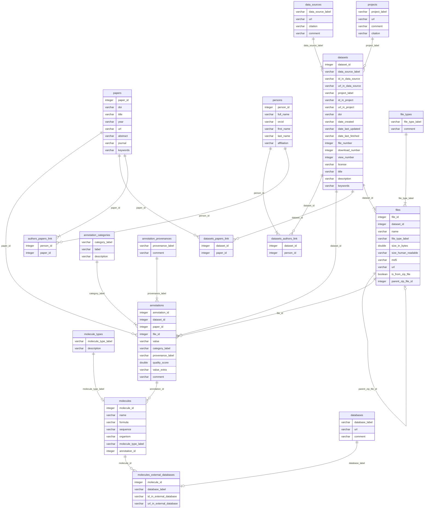

```mermaid
erDiagram
    molecule_types {varchar molecule_type_label varchar description}
    papers {integer paper_id varchar doi varchar title varchar year varchar url varchar abstract varchar journal varchar keywords}
    persons {integer person_id varchar full_name varchar orcid varchar first_name varchar last_name varchar affiliation}
    authors_papers_link {integer person_id integer paper_id}
    datasets_papers_link {integer dataset_id integer paper_id}
    molecules_external_databases {integer molecule_id varchar database_label varchar id_in_external_database varchar url_in_external_database}
    molecules {integer molecule_id varchar name varchar formula varchar sequence varchar organism varchar molecule_type_label integer annotation_id}
    annotation_categories {varchar category_label varchar label varchar description}
    annotation_provenances {varchar provenance_label varchar comment}
    databases {varchar database_label varchar url varchar comment}
    files {integer file_id integer dataset_id varchar name varchar file_type_label double size_in_bytes varchar size_human_readable varchar md5 varchar url boolean is_from_zip_file integer parent_zip_file_id}
    datasets {integer dataset_id varchar data_source_label varchar id_in_data_source varchar url_in_data_source varchar project_label varchar id_in_project varchar url_in_project varchar doi varchar date_created varchar date_last_updated varchar date_last_fetched integer file_number integer download_number integer view_number varchar license varchar title varchar description varchar keywords}
    data_sources {varchar data_source_label varchar url varchar citation varchar comment}
    file_types {varchar file_type_label varchar comment}
    annotations {integer annotation_id integer dataset_id integer paper_id integer file_id varchar value varchar category_label varchar provenance_label double quality_score varchar value_extra varchar comment}
    projects {varchar project_label varchar url varchar comment varchar citation}
    datasets_authors_link {integer dataset_id integer person_id}
    annotations ||--o{ molecules : "annotation_id"
    data_sources ||--|{ datasets : "data_source_label"
    molecule_types ||--o| molecules : "molecule_type_label"
    file_types ||--|{ files : "file_type_label"
    annotation_provenances ||--|{ annotations : "provenance_label"
    molecules ||--o{ molecules_external_databases : "molecule_id"
    datasets ||--o{ datasets_authors_link : "dataset_id"
    papers ||--o{ annotations : "paper_id"
    persons ||--|{ datasets_authors_link : "person_id"
    datasets ||--o{ annotations : "dataset_id"
    projects ||--o{ datasets : "project_label"
    papers ||--o{ datasets_papers_link : "paper_id"
    files ||--o| files : "parent_zip_file_id"
    databases ||--o| molecules_external_databases : "database_label"
    annotation_categories ||--|{ annotations : "category_label"
    persons ||--o{ authors_papers_link : "person_id"
    files ||--o{ annotations : "file_id"
    papers ||--|{ authors_papers_link : "paper_id"
    datasets ||--o{ datasets_papers_link : "dataset_id"
    datasets ||--|{ files : "dataset_id"
```
